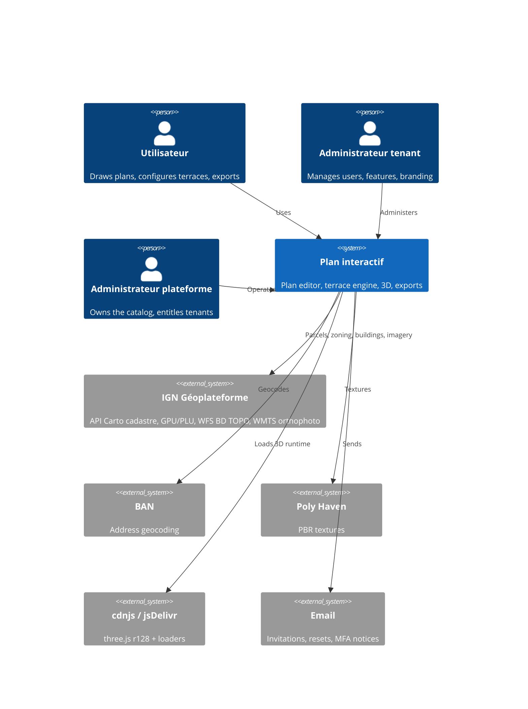
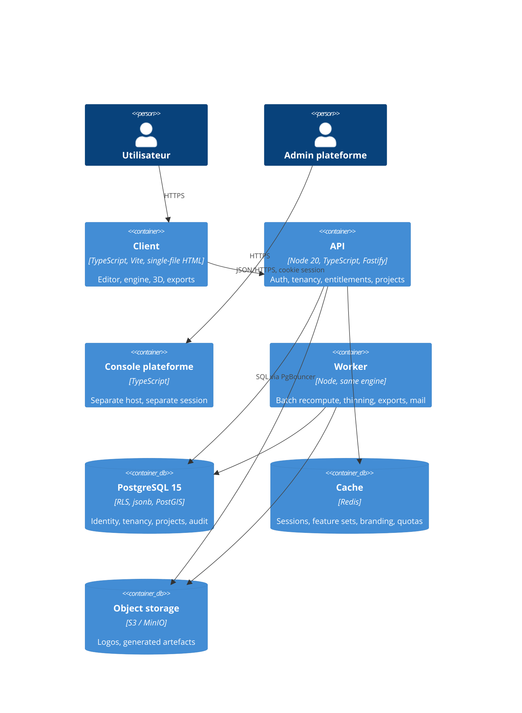

# Architecture — Plan interactif

**Version:** 1.0 — proposal for review
**Status:** living document; review cadence in §14
**Scope:** the whole system, present and target — client, backend, data, deployment, delivery

**Document set.** This is the entry point. Four specifications hang off it:

| Document | Answers |
|---|---|
| **this document** | How the system is put together, and why |
| `spec-migration-typescript.md` | How the client gets from one HTML file to a typed module graph |
| `spec-plateforme-multitenant.md` | Tenancy, authentication with MFA, feature catalog, branding |
| `spec-data-strategy.md` | What is stored where, and how it performs and evolves |
| `RELEASE.md` | How versions increment and releases ship |

---

## 1. Context

### 1.1 What the system is

A design and quantification tool for outdoor construction. A user imports a cadastral parcel from an address, draws the site in a metric SVG plan, configures a timber terrace, and gets back a structural design (screw or plot foundations, joists, battens, decking), a bill of materials with prices, a cutting plan, a setting-out plan, a site schedule, a 3D view, and a set of exportable artefacts — SVG, PNG, DXF, PDF, a multi-page PDF dossier, GLB, and the project file itself.

The quantities it produces are used to order material and to quote work. **That is the defining constraint of the whole architecture**: a number this tool emitted six months ago must be reproducible today, and a change that moves a number is a contractual event, not a bug fix.

### 1.2 Actors and external systems



Five external dependencies, all of them **availability dependencies, none of them data owners**. Every one degrades gracefully by design: no IGN means no cadastre import but a fully working editor; no CDN means no 3D but everything else; no Poly Haven means flat colours.

### 1.3 Architecturally significant requirements

| # | Requirement | Architectural consequence |
|---|---|---|
| ASR-1 | Quantities must be reproducible and auditable | Golden-file testing; engine constants in code, not configuration; versioned computed BOM stored with the project |
| ASR-2 | A project file must open in ten years | Document storage; a migration chain that is never truncated |
| ASR-3 | Deployment must stay trivial for small installs | Single-file client artefact preserved through the migration |
| ASR-4 | Multiple organisations, isolated | Tenant key on every row; three-layer isolation; server-side authority |
| ASR-5 | Features sold and switched per tenant | Feature catalog as data; entitlements enforced server-side; gated code lazily loaded |
| ASR-6 | Tenants present the tool under their own brand | Theme tokens resolved at runtime, including inside the SVG plan |
| ASR-7 | The tool must remain usable on a laptop in a garden, on a phone tether | 6 KB gzipped payloads; ETag revalidation; offline-tolerant failure modes |
| ASR-8 | A two-person team must be able to move fast | Enforced module boundaries; pure core; fast feedback loop |

---

## 2. Architecture principles

Ten principles. Each states a rule, why it holds here, and what it costs — a principle with no cost is a slogan.

| # | Principle | Rationale | Consequence accepted |
|---|---|---|---|
| **P1** | **The document is the contract.** The project JSON is the durable artefact; storage, transport, export and portability all use the same shape. | Ten-year readability (ASR-2); GDPR portability comes free; one shape to test | Cannot query inside a plan without the promotion path |
| **P2** | **The core is pure.** `engine/**` and `geometry/**` take plain data and return plain data — no DOM, no network, no clock, no globals. | Makes quantities testable to exact equality, deterministic, and reusable server-side at zero cost | Explicit parameter passing instead of ambient state |
| **P3** | **The client enforces nothing.** Every entitlement, role and tenant scope is decided server-side. Client-side gating is presentation only. | It is a browser; anything else is theatre | Every gated capability needs two implementations, and a test proving the server one |
| **P4** | **Data flows outward, never inward.** Facts live in the document; columns are derived duplicates promoted when a query needs them. | Makes promotion reversible — a wrong column is a `DROP COLUMN` | Slight duplication between `data` and `summary` |
| **P5** | **Behaviour is frozen by artefacts, not by intent.** Golden files define correctness; an unexplained diff is a breaking change. | ASR-1 | Every refactor pays a fixture-comparison cost |
| **P6** | **Boundaries are enforced by tooling.** Layering, purity and isolation are lint rules, dependency rules and tests — never conventions. | Conventions decay at exactly the moment the team is busiest | Up-front investment in fitness functions (§9) |
| **P7** | **Additive by default; breaking changes are versioned events.** New optional field: MINOR. Moved number: MAJOR. | ASR-1, ASR-2 | Occasional deliberate duplication rather than a clean rename |
| **P8** | **Configuration is data only where it must change without a release.** Catalog, entitlements, branding: data. Engine constants and prices: code. | A runtime-editable price table destroys BOM reproducibility | Price changes require a release |
| **P9** | **The domain speaks French.** `lambourde`, `entraxe`, `débit`, `plot`, `vis` are the ubiquitous language, traceable to NF DTU 51.4. | The spec *is* the vocabulary; translating it breaks traceability to the standard | Mixed-language identifiers, permanently |
| **P10** | **Degrade, never block.** Every external dependency has a defined failure mode that leaves the core tool working. | ASR-7 and five external systems | Explicit fallback paths and their tests |

---

## 3. Quality attributes, made measurable

The four drivers, expressed as scenarios with numbers. A scenario without a number is an aspiration.

### 3.1 Performance

| # | Scenario | Target | Tactic |
|---|---|---|---|
| QA-P1 | User opens the project list | p95 **< 10 ms** server, < 400 ms perceived on 4G | TOAST keeps `data` out of the query; `summary` serves the list; no `select *` (§9 FF-3) |
| QA-P2 | User opens a project (p99 payload, 600 KB) | p95 **< 40 ms** server, < 250 ms transfer | PK + detoast; brotli; `ETag` on `row_version` → 304 on revalidation |
| QA-P3 | User drags a vertex on a 12-object plan | sustained **60 fps**; ≥ 30 fps at 100 objects | rAF-coalesced redraw; drag-time partial update (§4.3 — a known gap today) |
| QA-P4 | User changes a terrace parameter (50 m², plots + joists) | full recompute **< 150 ms** | Synchronous pure engine; memoised structure between BOM and débit passes |
| QA-P5 | User opens the 3D view | scene ready **< 2 s** on 4G; **0 bytes** downloaded for tenants without `view.3d` | Dynamic `import()` behind `can()`; three.js from CDN, cached |
| QA-P6 | First visit, cold cache | artefact **≤ 1.2 MB**, TTI **< 3 s** on 4G | Single-file budget in CI; gated regions code-split out of the main bundle |
| QA-P7 | Cadastre import with full neighbourhood | **< 6 s** end to end | Parallel fan-out to API Carto + WFS; per-call timeouts; partial results usable |
| QA-P8 | Session bootstrap (every page load) | p95 **< 20 ms**, < 2 ms cached | Resolved feature set cached in T5, invalidated on entitlement/role/branding change |

### 3.2 Flexibility

| # | Scenario | Target | Tactic |
|---|---|---|---|
| QA-F1 | Add a terrace construction parameter | **≤ 1 day**, no DDL | JSON schema migration + one field descriptor; the configurator renders from descriptors |
| QA-F2 | Sell an existing feature to a new tenant | **no release**, effective immediately | Entitlement row; feature set re-resolved per session |
| QA-F3 | Add a new export format | **≤ 3 days**, no editor change | Exporters consume the pure model; `export/**` has no inbound dependencies |
| QA-F4 | Recompute every tenant's BOM after an engine fix | **0 lines of new logic** | P2: the engine already runs outside a browser |
| QA-F5 | Add a brandable token | **≤ 2 hours** | One entry in the token list + one validator rule |
| QA-F6 | Query plans by a document attribute not yet indexed | **≤ 1 day**, no downtime | Promotion path, stage 1 → `summary` + batched backfill |
| QA-F7 | Support a second national cadastre (e.g. Belgium) | **≤ 3 weeks** | `geo/**` is a port: one provider interface, `projecteurLocal` already generic |

### 3.3 Quality

| # | Scenario | Target | Tactic |
|---|---|---|---|
| QA-Q1 | Any refactor lands | golden artefacts **byte-identical** | Fixture suite as a release gate (P5) |
| QA-Q2 | Engine change lands | **≥ 80 %** line coverage on `engine/**`, exact-equality assertions | Purity (P2) makes this cheap |
| QA-Q3 | Any release with tenancy | cross-tenant isolation suite **green**, all ~20 endpoints | Three-layer isolation; parameterised A/B tenant tests |
| QA-Q4 | Any entitlement-gated endpoint | a passing **403-without-entitlement** test exists | Route-registry reconciliation (FF-7) |
| QA-Q5 | Any domain code | **zero `any`**, `strict` on | tsconfig ratchet; lint scoped to `model`/`engine`/`geometry` |
| QA-Q6 | Production incident | version and build SHA in **every** bug report | Version in the UI, in headers, in every export |
| QA-Q7 | Backup | restore drill **quarterly**, documented RTO | An untested backup is a belief |

### 3.4 Velocity

| # | Scenario | Target | Tactic |
|---|---|---|---|
| QA-V1 | Developer pushes a commit | typecheck + lint + unit **< 5 min**; full suite **< 15 min** | Pure unit tests dominate; browser tests are a thin layer |
| QA-V2 | Typical feature change | touches **≤ 3 files** | One-concern modules; field descriptors; feature keys |
| QA-V3 | New developer joins | ships a real change **in week 1** | Module map, ADRs, and the fact that boundaries are mechanical (P6) |
| QA-V4 | Ship a fix to production | **< 30 min** from merge | Single static artefact; publish and done |
| QA-V5 | Two developers work in parallel | **no structural merge conflicts** | Dependency rules prevent the shared-file gravity well |
| QA-V6 | Release cadence | MINOR every **2–4 weeks** | Trunk-based, squash merges, changelog written in the PR |

---

## 4. AS-IS architecture

### 4.1 Containers today

```
┌────────────────────────── Browser ──────────────────────────┐
│  plan_interactif.html  (773 KB, 13 487 lines, one file)     │
│   ├─ <style>            lines    6–  226                    │
│   ├─ shell markup       lines  228–  596   (165 ids)        │
│   ├─ script block 1     lines  597– 1009   (dialogs, API)   │
│   └─ script block 2     lines 1010–13485                    │
│        └─ boot(seed) { …12 450 lines, ~320 functions,       │
│                        ~150 closure variables… }            │
└──────────┬──────────────────────────────────────┬───────────┘
           │ fetch                                 │ fetch
      ┌────▼─────┐                    ┌────────────▼─────────────┐
      │ api.php  │                    │ IGN · BAN · Poly Haven   │
      │ flat     │                    │ cdnjs · jsDelivr         │
      │ files    │                    └──────────────────────────┘
      └──────────┘
```

One container, one file, no build step, no auth, no database.

### 4.2 What is genuinely good, and must survive

Not politeness — these are load-bearing and easy to destroy in a rewrite.

| Asset | Evidence | Why it matters |
|---|---|---|
| **A serialisation boundary already exists** | `serializeObjects()`, `normalizeObjects()`, `validerProjetJSON()`, `snapshotState()` | P1 and P4 are already half-implemented; the document shape is real, tested by round-trips, and stable |
| **The domain model is coherent** | `construction` carries ~50 parameters; the engine is a genuine structural calculator traceable to NF DTU 51.4 | This is the product's actual value; it is worth protecting with tests before touching anything else |
| **Complete theming tokens** | 13 CSS custom properties, full dark-mode block | Tenant branding is token substitution, not a restyle (ASR-6) |
| **Central mutation wrapper** | `mutate()` wraps change + snapshot + re-render | A ready-made seam for the event bus and dirty tracking |
| **Deliberate degradation** | Fallback to demo data only when no project id is known; documented as fix M5 | P10 is already the author's instinct |
| **No `eval`, no inline `onclick`, no framework lock-in** | grep | The migration has no landmines of that class |

### 4.3 Weaknesses, with their architectural consequence

| # | Weakness | Evidence | Consequence |
|---|---|---|---|
| W1 | One 12 450-line closure; no module boundaries | `boot(seed)` | Blocks QA-V2, QA-V5, all of §3.2; makes P6 impossible |
| W2 | Data and view are the same object | `obj.el`, `obj.pointEls`, `obj.edgeEls` alongside `obj.pts` | Blocks P2; forces defensive stripping before every serialise |
| W3 | Full redraw on every change | `render()` called from 88 sites | QA-P3 holds at 12 objects, degrades at 100 |
| W4 | Plan colours hard-coded in JS, evaluated once at boot | lines 1209–1216 | Blocks ASR-6 inside the plan; no reaction to a scheme change |
| W5 | No authentication, guessable project ids | `?projet=` | Blocks ASR-4 entirely |
| W6 | Flat-file storage | `api.php` | Cannot express tenants, entitlements, audit, or optimistic locking |
| W7 | No build, no tests, no types | — | Blocks QA-Q1..Q5 and QA-V1 |
| W8 | 3D runtime from public CDN, unpinned integrity | 4 runtime `<script>` injections | Availability and supply-chain exposure |
| W9 | Undo stack named `history` | line 1016 | Shadows `window.history`; becomes a silent bug the moment modules exist |
| W10 | Four functions over 350 lines | 773 / 725 / 634 / 365 | Review capacity, merge conflicts, QA-V2 |

### 4.4 Honest summary

The **domain architecture is sound and the delivery architecture does not exist.** The model, the engine and the serialisation boundary are the work of someone who understood the problem. Everything blocking §3 is structural — scope, typing, storage, authority — and none of it requires rethinking what the product does. That is the good case: a transformation, not a rewrite.

---

## 5. TO-BE architecture

### 5.1 Containers



**Why Node/TypeScript for the API rather than keeping PHP.** One reason decides it: the engine is pure TypeScript (P2), so running it server-side — batch re-pricing, server-generated dossiers, validating a submitted BOM — costs *zero new logic*. Any other runtime means maintaining a second implementation of the structural calculator, which would be the single worst thing that could happen to ASR-1. Shared types between client and server across the whole `model/**` layer is a large secondary benefit.

### 5.2 Client component view

```
                        main.ts
                           │
              ┌────────────┴────────────┐
              ▼                         ▼
         auth/shell               tenancy/context
      (login · mfa · enrol)   (session · features · branding)
                                        │
                                theme/apply · theme/read
                                        │
                                   createApp(ctx)
                                        │
        ┌───────────┬───────────┬───────┴────┬───────────┬──────────┐
        ▼           ▼           ▼            ▼           ▼          ▼
      core/       render/   interaction/    ui/       export/     three/
    state·bus                                                   (lazy)
        │           │           │            │           │          │
        └───────────┴───────────┴─────┬──────┴───────────┴──────────┘
                                      ▼
                            engine/ · geometry/ · geo/
                                      ▼
                                   model/ · util/          ← pure, no DOM, no IO
```

The arrows only point down. That is P6, and §9 FF-1/FF-2 make it mechanical.

The **pure core** (`model`, `util`, `geometry`, `engine`) is a library. It happens to be bundled into a browser app today; nothing about it assumes one. That is what makes QA-F4 free and QA-Q2 cheap.

### 5.3 Data view

Five tiers, per `spec-data-strategy.md`:

```
T1 relational   tenants · users · memberships · sessions · mfa
                features · tenant_features · tenant_usage
                projects (envelope) · project_versions (envelope) · assets · audit(partitioned)
T2 document     projects.data  ── the plan, opaque, versioned by schema_version
T3 derived      projects.summary · footprint · parcelle_idu · commune_insee   (rebuildable)
T4 binary       logos, favicons, generated artefacts        (object storage)
T5 ephemeral    sessions, resolved feature sets, branding, quota counters   (Redis)
```

### 5.4 Security view

```
Browser ──cookie (HttpOnly·Secure·SameSite=Strict)──▶ API
                                                      │ 1. session → user, tenant, role
                                                      │ 2. CSRF token on unsafe methods
                                                      │ 3. requireRole · requireFeature · quota
                                                      │ 4. SET LOCAL app.tenant_id
                                                      ▼
                                                  PostgreSQL
                                                      │ 5. RLS policy per tenant
                                                      │ 6. repository layer cannot construct
                                                      │    a query without a TenantContext
```

Six checks, three of them independent isolation layers. TOTP MFA, step-up re-authentication for sensitive operations, append-only audit. Detail in `spec-plateforme-multitenant.md`.

### 5.5 Deployment view

```
                    ┌── CDN ──┐
   Browser ─────────┤ index   │  single file, immutable, hashed URL
                    └─────────┘
                         │
                    ┌────▼──────────┐
                    │ Reverse proxy │  TLS · brotli · rate limit · CSP
                    └────┬──────────┘
                ┌────────┴─────────┐
           ┌────▼────┐       ┌─────▼─────┐
           │ API × N │       │ Worker ×1 │
           └────┬────┘       └─────┬─────┘
                └────────┬─────────┘
                    ┌────▼─────┐
                    │ PgBouncer│  transaction pooling
                    └────┬─────┘
                    ┌────▼──────────────┐
                    │ Postgres primary  │  WAL archiving · PITR 35 d
                    └───────────────────┘
```

Environments: `dev` (local, Docker Compose), `staging` (production-shaped, with a copy of production data structure and volume), `production`. The client artefact is identical across all three; only its API origin differs, injected at build time.

**The single-file property survives.** Small on-premise installs remain a matter of copying one HTML file plus running the API container — ASR-3 preserved.

### 5.6 Runtime scenario — cold start

```
1. GET /              → CDN, single file          (cached, immutable)
2. localStorage       → branding for last tenant  → applied optimistically, no flash
3. GET /api/v1/session
        ├─ 401  → mount auth shell (unbranded — theming an unauthenticated page
        │          would leak tenant existence)
        └─ 200  → { user, tenant, role, features, branding, csrfToken,
                    minClientVersion, currentVersion }
4. reconcile branding etag; apply theme tokens into <style id="tenant-theme">
5. version check → block writes if APP_VERSION < minClientVersion
6. GET /api/v1/projects/:id  (If-None-Match: W/"<row_version>")
        └─ 304 or 40 KB payload
7. migrate document to SCHEMA_VERSION → normalizeObjects → createApp → render
8. features.view3d.on ? nothing yet : three/** never downloaded
```

### 5.7 Runtime scenario — save under contention

```
Client                                  API                         Postgres
  │ PUT /projects/:id                    │                             │
  │ If-Match: W/"7"  + Idempotency-Key   │                             │
  ├─────────────────────────────────────▶│ SET LOCAL app.tenant_id     │
  │                                      ├────────────────────────────▶│
  │                                      │ UPDATE … WHERE row_version=7│
  │                                      │ INSERT project_versions     │
  │                                      │◀───── 0 rows ───────────────┤
  │◀──── 409 + current row_version ──────┤                             │
  │                                                                    │
  │ "Ce projet a été modifié par X. Comparer / Écraser / Enregistrer   │
  │  sous un nouveau nom." — the plan in memory is never discarded.    │
```

Losing an afternoon of drawing to a silent last-write-wins is the worst non-security failure this system can have. It is designed out, not monitored for.

---

## 6. How the architecture delivers each driver

### 6.1 Performance

| Tactic | Where | Serves |
|---|---|---|
| Payload out-of-line (TOAST); never `select *` | data layer | QA-P1 |
| `summary` projection for lists | data layer | QA-P1 |
| ETag on `row_version`; brotli | transport | QA-P2 |
| Code-splitting gated regions behind `can()` | client | QA-P5, QA-P6 |
| Synchronous pure engine, memoised between passes | `engine/**` | QA-P4 |
| rAF-coalesced rendering, drag-time partial update | `render/**` | QA-P3 |
| Resolved feature set cached in T5 | API | QA-P8 |
| Parallel fan-out with per-call timeouts | `geo/**` | QA-P7 |
| Bundle budget enforced in CI | build | QA-P6 |

Note W3 honestly: full redraw is fine at today's object counts and is the first thing to hit when neighbourhood imports push plans past ~100 objects. The tactic is identified, not yet implemented; it is scheduled with `render/**` in migration Phase 4 and gated by a benchmark, not a hunch.

### 6.2 Flexibility

| Tactic | Serves |
|---|---|
| Document storage + never-truncated migration chain | QA-F1, ASR-2 |
| Promotion path (document → summary → column → index), reversible | QA-F6 |
| Feature catalog and entitlements as data | QA-F2 |
| Field descriptors driving the configurator UI | QA-F1 |
| Pure core with no inbound dependencies | QA-F3, QA-F4 |
| Provider interfaces in `geo/**` | QA-F7 |
| Reserved extension points (`meta.custom`, `tenants.settings`, `projects.kind`) | unknown futures |
| Discriminated unions with enforced exhaustiveness | every new object type or BOM poste |

### 6.3 Quality

| Tactic | Serves |
|---|---|
| Golden fixtures as a release gate | QA-Q1 |
| Pure core → exact-equality unit tests including float artefacts | QA-Q2 |
| Cross-tenant isolation suite, parameterised over every endpoint | QA-Q3 |
| Route registry reconciled against the 403-test registry | QA-Q4 |
| `strict` TypeScript, ratcheted; `no-explicit-any` in domain code | QA-Q5 |
| Version and build SHA in UI, headers, and every export | QA-Q6 |
| Append-only audit; quarterly restore drill | QA-Q7 |
| Optimistic locking with an explicit conflict UX | data integrity |

### 6.4 Velocity

| Tactic | Serves |
|---|---|
| Test pyramid weighted to pure unit tests | QA-V1 |
| One-concern modules; the four >350-line functions decomposed | QA-V2, QA-V5 |
| Enforced dependency direction — no shared-file gravity well | QA-V5 |
| Feature keys and field descriptors: new capability = data + one arm | QA-V2 |
| Living module map + ADR index | QA-V3 |
| Single-artefact deploy; trunk-based; squash merges | QA-V4, QA-V6 |
| Changelog written in the PR, not at release time | QA-V6 |

**The velocity argument in one line:** velocity here comes from *narrow blast radius*, not from skipping steps. The pure core means a terrace-engine change cannot break the 3D view; the dependency rules mean two developers rarely touch the same file; the golden fixtures mean a refactor is safe to merge on a Friday afternoon because the evidence is mechanical.

---

## 7. Cross-cutting concerns

| Concern | Decision |
|---|---|
| **Error handling** | Typed results at boundaries (`Parsed<T>`, `ApiError` with a `reason` union). User-facing messages in French, actionable, never a stack trace. The existing top-level error banner stays as the last resort. |
| **Degradation (P10)** | IGN down → editor works, import disabled with a reason. CDN down → 3D disabled, everything else works. API down → the plan in memory is never lost; offer a local JSON export. Session expired mid-edit → auth shell with the work preserved. |
| **Observability** | Structured JSON logs with `tenant_id`, `user_id`, `request_id`, `app_version`. RED metrics per endpoint. Client-side error reporting with the build SHA. Data-layer metrics per `spec-data-strategy.md` §11. |
| **Configuration** | Build-time: API origin, version, SHA. Runtime server-side: connection strings, keys, `minClientVersion`. Runtime data: catalog, entitlements, branding. Never runtime-editable: engine constants and price tables (P8). |
| **Internationalisation** | UI strings in French, externalised into a message catalog during migration Phase 5 so a second locale is possible. **Domain identifiers are never translated** (P9). |
| **Accessibility** | Keyboard navigation for panels and dialogs; contrast enforced on branding (rejected below 4.5:1); the SVG canvas is inherently pointer-driven and gets a documented numeric-entry alternative for coordinates. |
| **Supply chain** | Pinned versions, lockfile, `npm audit` in CI, SRI hashes on the three CDN scripts (currently absent — W8). Bundling three.js remains the fallback if CDN reliability disappoints. |
| **Offline** | Not a goal for 2.x. The architecture does not preclude it: 6 KB payloads plus `row_version` reconciliation is a well-understood PWA shape. |

---

## 8. Transition — strangler, not rewrite

```
1.0.0  ── legacy single file, tagged, golden fixtures captured ───────────┐
                                                                          │ oracle
1.0.x  ── Vite + TS shell; legacy.ts with @ts-nocheck                     │
          modules extracted outward-in, legacy.ts shrinking each phase ◀──┘
1.1.0  ── legacy.ts deleted; strict TypeScript; zero behaviour change
2.0.0  ── backend, auth + MFA, tenancy, data migration           ← first breaking release
2.1.0  ── feature catalog, entitlements, server enforcement
2.2.0  ── branding (incl. the SVG token rework, W4)
2.3.0  ── PDF logo, platform console, PostGIS, audit automation
```

Every phase ends deployable. The legacy file is never forked and never rewritten in parallel — it is *replaced module by module*, with the golden fixtures adjudicating each step. Total: ~54 days of migration, ~70 days of platform work, per the respective specs.

The sequencing is not negotiable in one respect: **the migration completes before tenancy starts.** Building authorisation into the current closure would scatter security decisions across the same scope as the drag handlers, and no amount of later refactoring recovers from that.

---

## 9. Fitness functions

P6 in practice. Each runs in CI and fails the build. This is what makes the word "strong" in "strong architecture" mean something checkable.

| # | Fitness function | Protects | Mechanism |
|---|---|---|---|
| FF-1 | No import cycles | layering | `import/no-cycle`, error |
| FF-2 | `engine/**`, `geometry/**`, `model/**` import nothing from `ui`, `render`, `three`, `geo`, `persistence`, or the DOM | P2, QA-F4 | `no-restricted-imports` + dependency-cruiser rule |
| FF-3 | No query selects `projects.data` without a single-row predicate | QA-P1 | Query-log assertion in the integration suite |
| FF-4 | Golden artefacts byte-identical | P5, QA-Q1 | Fixture diff, release gate |
| FF-5 | Bundle ≤ 1.2 MB; no gated module in the main chunk | QA-P6, QA-P5 | Rollup output analysis |
| FF-6 | `FeatureKey` union matches the seeded catalog exactly | QA-F2 | Drift test against the DB |
| FF-7 | Every entitlement-gated route has a 403-without-entitlement test | QA-Q4 | Route registry × test registry reconciliation |
| FF-8 | RLS enabled on every tenant-scoped table | ASR-4 | `pg_class.relrowsecurity` introspection test |
| FF-9 | No `any` in `model`/`engine`/`geometry` | QA-Q5 | ESLint, scoped |
| FF-10 | No function over 150 lines | QA-V2 | `max-lines-per-function`, ratcheted after Phase 7 |
| FF-11 | Every `SCHEMA_VERSION` has a migration and an N/N+1 fixture | ASR-2 | Test enumerating the chain |
| FF-12 | p95 latency budgets (§3.1) hold under a 50-user load test | QA-P1/P2/P8 | Nightly load test on staging |
| FF-13 | Commit message format; behavioural change carries a changelog diff | QA-V6 | CI check |
| FF-14 | Engine benchmark: full terrace recompute < 150 ms | QA-P4 | Vitest bench, threshold |

A fitness function that fires often and is routinely overridden is worse than none — it teaches the team that the build lies. Each one above is either fixable in minutes or genuinely wants a design conversation.

---

## 10. Architecture decision index

| ADR | Decision | Alternative rejected | Driver |
|---|---|---|---|
| ADR-1 | TypeScript migration in place, module by module | Rewrite; framework adoption | ASR-1 (golden-file adjudication is only possible in place) |
| ADR-2 | No UI framework; SVG + direct DOM | React / Svelte | Regression attributability; QA-P3 is about draw strategy, not virtual DOM |
| ADR-3 | Node + TypeScript API | Keep PHP; Go; Python | P2 — server-side engine reuse at zero cost (QA-F4) |
| ADR-4 | Single-file client artefact preserved | Conventional multi-asset SPA | ASR-3 |
| ADR-5 | PostgreSQL, single instance | Mongo; S3-as-database; sharding | 5 GB at target scale; RLS and jsonb both needed |
| ADR-6 | Document storage for the plan | Full normalisation | Array order is semantic; access is whole-document |
| ADR-7 | Server-side sessions, opaque cookie | JWT in localStorage | Instant revocation; long-lived tabs |
| ADR-8 | TOTP MFA first; WebAuthn later | WebAuthn first | Interoperability and enrolment friction |
| ADR-9 | Feature catalog as data; enforcement in code | Feature flags in config files | QA-F2 without a release |
| ADR-10 | Branding as validated tokens, never raw CSS | Tenant stylesheet | Injection surface |
| ADR-11 | three.js from CDN with ambient types | Bundle three.js | Bundle budget; revisit if reliability disappoints (W8) |
| ADR-12 | Engine constants in code | Runtime price configuration | ASR-1 reproducibility |
| ADR-13 | Optimistic locking on `row_version` | Last-write-wins; pessimistic locks | Whole-document writes make silent loss the default |
| ADR-14 | Full-copy version history | Diffs; none | ~7 KB per save; one-step restore |
| ADR-15 | Audit partitioned from day one | Single table | Cannot be retrofitted cheaply |

Each ADR gets its own file under `docs/adr/NNNN-*.md` in the Nygard format, with status (`proposed` / `accepted` / `superseded`). An ADR is never edited after acceptance — it is superseded by a new one, so the reasoning history survives.

---

## 11. Architectural debt register

Carried deliberately, with the trigger that would force payment.

| # | Debt | Cost of carrying | Trigger to pay |
|---|---|---|---|
| AD-1 | Full redraw on every change (W3) | Fine today; degrades past ~100 objects | FF-14-style benchmark breaches 30 fps |
| AD-2 | Mixed French/English identifiers | Mild cognitive cost | Never — deliberate (P9) |
| AD-3 | Hand-written PDF writer, no image support | Logo branding costs 3–4 days | If PDF requirements grow beyond a logo and a footer |
| AD-4 | three.js pinned at r128 from CDN | Missing five years of upstream fixes | A needed feature or a security advisory |
| AD-5 | `unsafe-inline` in the style CSP | Weakens CSP for style vectors | When shell inline styles move to classes; then switch to a nonce |
| AD-6 | No offline mode | Field users on poor connections | Sustained user complaints; the shape is understood |
| AD-7 | Single Postgres instance, no replica | Reporting competes with OLTP | R1/R3 p95 sustained > 50 ms |
| AD-8 | No collaborative editing | Save conflicts surface as 409s | 409 rate rising — the metric is already instrumented |

Reviewed quarterly. Debt that is written down and monitored is a decision; debt that is not is a surprise.

---

## 12. Risk summary

| # | Risk | Sev | Mitigation | Owner |
|---|---|---|---|---|
| R1 | Cross-tenant data exposure | **Critical** | Three isolation layers; FF-8; isolation suite as a release gate; external pentest | Backend |
| R2 | Silent drift in computed quantities | **Critical** | Golden fixtures with exact float equality; MAJOR-release rule | Engine |
| R3 | Migration Phase 4 becomes an unmergeable branch | High | Strict ordering; ≤ 400 lines per PR; `legacy.ts` always compiles | Frontend |
| R4 | Data loss on concurrent save | High | Optimistic locking; explicit conflict UX; version history | Backend |
| R5 | Feature gating implemented client-side only | High | FF-7; every gated endpoint ships with its 403 test | Backend |
| R6 | Branding as a CSS injection vector | High | Validated tokens only; no raw CSS; CSP | Frontend |
| R7 | Scope creep (SSO, billing, WebAuthn, collaboration) into 2.0.0 | High | Explicitly deferred; catalog reserves keys without implementations | Product |
| R8 | External API drift (IGN, BAN) confounds testing | Medium | HTTP fixtures recorded; tests never hit live endpoints | Frontend |
| R9 | Supply chain via unpinned CDN scripts | Medium | SRI hashes; bundling as fallback (AD-4) | Frontend |
| R10 | Backup that has never been restored | Medium | Quarterly drill with documented RTO — QA-Q7 | Ops |

---

## 13. What "done" looks like

The architecture is working when all of the following are true simultaneously:

- A developer changes a terrace formula, sees the golden fixture diff, understands the release implication from `RELEASE.md` §2.1, and ships or escalates — **without asking anyone**.
- A commercial decision to sell 3D to a tenant is an entitlement row, not a release.
- A tenant's brand reaches the plan, the north arrow, the measure lines and the PDF footer, and a tenant admin cannot make their own users' screens unreadable.
- The BOM engine runs unchanged in a Node worker over 30 000 stored projects.
- A project file written in 2026 opens in 2032, migrated silently through its chain.
- Two people ship in parallel for a fortnight with no structural merge conflict.
- The last restore drill was under three months ago and passed.

---

## 14. Governance

| Aspect | Rule |
|---|---|
| Ownership | One accountable architect; the document lives in the repo, changed by PR |
| Review cadence | Quarterly, plus before each MAJOR release |
| Change trigger | Any new ADR, any breach of a fitness function that leads to changing the rule rather than the code, any new architecturally significant requirement |
| Decision record | ADRs are append-only and superseded, never edited |
| Fitness functions | Reviewed with the same cadence; one that is routinely overridden is either fixed or deleted, never left firing |
| Debt register | Reviewed quarterly; each entry restated with its trigger, or paid |
| Definition of architecture done, per feature | Layer respected · fitness functions green · ADR written if a decision was made · quality-attribute scenario identified or added · debt logged if incurred |

> An architecture document that is not enforced by CI and not reviewed on a calendar becomes fiction within two releases. §9 and §14 are what keep this one true.
